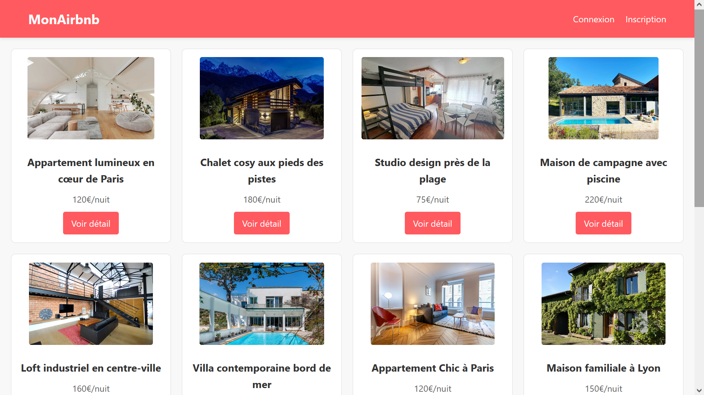

# Projet Locations Vacances - Plateforme style Airbnb



## 📝 Description
Plateforme web de location de logements de vacances développée avec Node.js/Express. 

## 🌟 Fonctionnalités 

 -   ✅ Page d'accueil listant toutes les annonces

 -   ✅ Pages de détail pour chaque logement

 -   ✅ Système de templates avec EJS

 -   ✅ Service de fichiers statiques (CSS/images)

 -   ✅ Données persistantes via JSON

 -   🎉 Système d'authentification complet

 -   🗺 Intégration de Leaflet.js pour les cartes

 -   📱 Design responsive

 -  ⚙️ CRUD complet pour les annonces

 -  👑 Système de droits admin


## 🛠 Technologies utilisées
- **Front-end**:
  - HTML5, CSS3
  - EJS (templating)
  - Leaflet.js (cartes)
  - Font Awesome (icônes)

- **Back-end**:
  - Node.js
  - Express.js
  - Express-session (authentification)
  - Multer (upload d'images)

## 🚀 Installation

### Prérequis
- Node.js (v14+)
- npm

### Étapes
1. Cloner le dépôt :
```bash
git clone https://github.com/Jk-kor/JSprojet.git

2. Installer les dépendances :
```bash
npm install
```

3. Démarrer le serveur :
```bash
node server.js
```

4. Accéder à l'application :
```bash
http://localhost:3000
```


 ## 📂 Structure des fichiers

```
    project/
├── public/
│   ├── images/          # Images des logements
│   ├── css/             # Feuilles de style
│   └── js/              # Scripts front-end
├── views/
│   ├── partials/        # Composants réutilisables
│   ├── accueil.ejs      # Page d'accueil
│   └── ...              # Autres pages
├── logement.json        # Base de données des annonces
├── users.json           # Base de données des utilisateurs
└── server.js            # Serveur principal
```

## Crédits

Projet réalisé dans le cadre d'un exercice pédagogique, par Lee Jinkyu et Renou Baptiste.